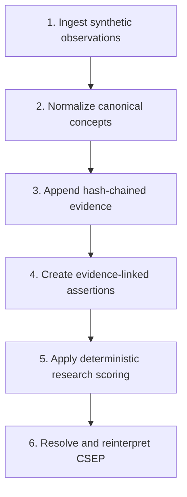

# VLEP Research MVP

VLEP is a research software platform for representing epilepsy as a versioned longitudinal phenotype instead of a single static label. This repository contains a working investor-facing MVP built around three software contracts:

1. Preserve source evidence in a tamper-evident append-only ledger.
2. Resolve an auditable six-dimensional Current-State Epilepsy Profile (CSEP).
3. Reinterpret that profile under a newer classification framework without rewriting the evidence.

> **Research prototype. Synthetic data only. Not for diagnosis, treatment, or clinical use.** The public demo establishes software behavior and traceability; it does not establish diagnostic validity, clinical utility, or patient safety.

## What works now

| Capability | Current evidence |
|---|---|
| Six-stage synthetic pipeline | Deterministic Python core and interactive React workbench |
| Evidence preservation | Canonical SHA-256 chain with tamper-detection tests |
| Six-dimensional CSEP | Seizure, etiology, syndrome, biomarkers, comorbidity, treatment |
| Nosology reinterpretation | Explicit ILAE 2017 → 2025 terminology mapping |
| Review boundary | Conditional mappings are flagged instead of treated as lossless |
| Reproducibility | Stable run, bundle, ledger, and profile hashes |
| Public delivery | GitHub Pages workflow and production frontend build |
| Safety boundary | Synthetic-fixture gate, no-PHI policy, model/data cards |

The supplied database-backed FastAPI prototype remains in the repository as an engineering foundation. Its PostgreSQL services, migrations, API routers, and broader statistical modules are **not** represented as production-ready or clinically validated by this MVP.

## The working demonstration

The investor workbench runs a fictional case (`SYN-0042`) through:



The formal resolution contract is:

$$P_{snapshot}(t) = F(L_{\leq t}, N)$$

where `L` is the immutable evidence ledger and `N` is the selected nosology release.

The implemented 2017 → 2025 example is intentionally conditional: ILAE 2025 replaces the 2017 awareness classifier with consciousness, defined using awareness and responsiveness. VLEP therefore preserves the source term and requires reviewer confirmation before accepting the new interpretation.

## Run locally

Requirements: Python 3.11+, Node.js 20+.

```bash
# Verify the deterministic research core
python -m unittest discover -s tests_mvp -v

# Regenerate the signed public fixture
python scripts/export_investor_demo.py

# Start the investor site
cd apps/investor-demo
npm ci
npm run dev
```

Production verification:

```bash
cd apps/investor-demo
npm run typecheck
npm run build
npm run preview
```

## Repository map

```text
apps/investor-demo/        Investor-facing React + Vite product
data/                      Synthetic public fixture only
docs/                      Architecture, validation, model/data cards, roadmap
migrations/                PostgreSQL schema foundation
scripts/                   Fixture export and schema utilities
tests_mvp/                 Dependency-light MVP correctness tests
vlep/research_mvp/         Deterministic research core
vlep/api, models, services Database-backed platform prototype
```

## Evidence boundary

The project source material describes a literature corpus of 239 phenotype-defining claims. That underlying claim artifact is not present in the supplied repository, so the public MVP does not present `239`, `97.4%`, `91%`, or any other documentary performance number as a verified product metric.

The formal Stan document is treated as a model specification and research direction. The public MVP does not claim that Bayesian posterior inference, GLMM/HMM integration, survival calibration, external cohort validation, or clinical deployment has been completed.

## Documentation

- [Architecture](docs/ARCHITECTURE.md)
- [Investor brief](docs/INVESTOR_BRIEF.md)
- [Validation plan](docs/VALIDATION_PLAN.md)
- [Model card](docs/MODEL_CARD.md)
- [Data card](docs/DATA_CARD.md)
- [Research disclaimer](docs/RESEARCH_DISCLAIMER.md)
- [Roadmap](docs/ROADMAP.md)
- [Security policy](SECURITY.md)

## Primary terminology sources

- [ILAE Operational Classification of Seizure Types (2017)](https://www.ilae.org/guidelines/definition-and-classification/operational-classification-2017)
- [ILAE Updated Classification of Epileptic Seizures (2025)](https://www.ilae.org/updated-classification-epileptic-seizures-2025)
- [ILAE Definition and Classification index](https://www.ilae.org/guidelines/definition-and-classification)

ILAE is an external standards body and does not endorse this project.

## Naming

The project specifications consistently define **CSEP** as “Current-State Epilepsy Profile.” This repository uses CSEP as the canonical acronym; “CESP” is treated as an alternate transposition in informal project references.

## Rights

Copyright © 2026 Michael Manthe. All rights reserved. See [LICENSE](LICENSE).
