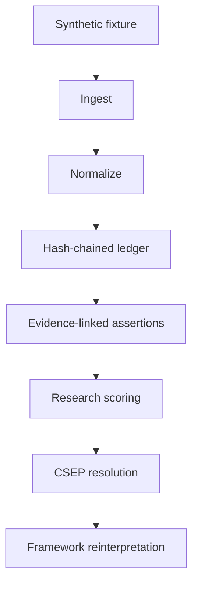

# VLEP Research MVP Architecture

## Communication job

The MVP demonstrates that a versioned phenotype can be reproduced, inspected, and reinterpreted without mutating its evidence. It does not attempt to reproduce an EHR, diagnose epilepsy, or execute the full probabilistic research specification.

## Executable boundary

The public path is dependency-light and deterministic:

`vlep/research_mvp` owns this path. The generated `demo-bundle.json` is the signed boundary between the Python engine and the React workbench. The browser animates and inspects a run; it does not invent profile values.

## Core invariants

### A1 - Evidence preservation

Ledger hashes cover each event’s sequence, identifier, time, domain, raw text, source, source confidence, normalization result, and prior hash. A terminology update changes the profile hash, not the evidence hash.

### A2 - Deterministic resolution

For the same fixture, as-of time, engine version, and framework:

$$F(L_{\leq t}, N) = P_{snapshot}(t)$$

replays must produce identical ledger, profile, run, and bundle hashes.

### A3 - Reviewable mappings

A mapping may be `exact`, `conditional`, or `manual_review`. Only explicit mappings are applied. The 2017 awareness → 2025 consciousness example is conditional because the target classifier incorporates both awareness and responsiveness.

### A4 - Synthetic-only public input

The public core rejects fixtures not marked `synthetic`, requires a `SYN-` case ID, and rejects common direct-identifier keys.

## Six CSEP dimensions

| Dimension | MVP representation | Current limitation |
|---|---|---|
| Seizure | Framework-specific terminology | One explicit demonstration mapping |
| Etiology | Evidence-ranked label | Deterministic rules, not causal inference |
| Syndrome | Evidence-linked candidate | Always requires review |
| Biomarkers | Combined EEG/MRI fixture findings | No signal/image processing |
| Comorbidity | Reported synthetic observation | No severity instrument |
| Treatment | Observed treatment trial | No recommendation or response prediction |

## Legacy platform foundation

The repository also includes FastAPI routers, SQLAlchemy models, PostgreSQL migrations, an append-only database trigger, governance models, feature engineering services, and preliminary statistical services. Those modules informed the architecture, but they are outside the public MVP’s validated execution boundary until their integration, authentication, migrations, and full test suite are hardened.

## Deployment

GitHub Actions regenerates the deterministic bundle, type-checks and builds the React application, and deploys the immutable static artifact to GitHub Pages. No server, patient database, secret, or external model endpoint is required for the investor demo.
